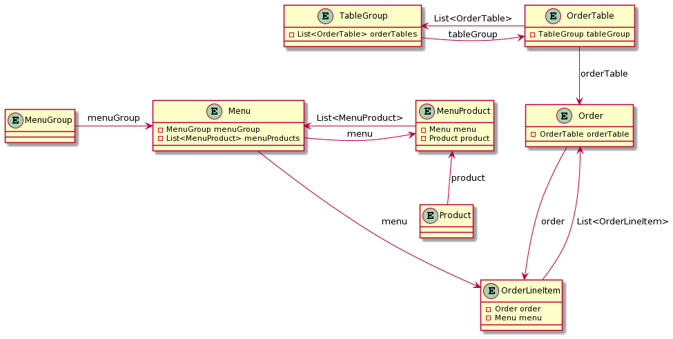
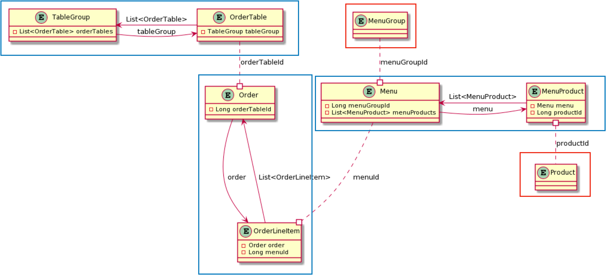
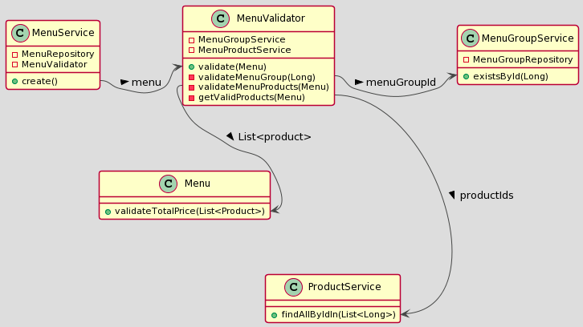

# 키친포스

## 요구 사항

---
### 상품
    - 상품 등록
        - 상품 가격은 0원 이상 이어야 한다.
    - 상품 리스트 조회
---
### 메뉴 그룹
    - 메뉴 그룹 등록
    - 메뉴 그룹 리스트 조회
---
### 메뉴
    - 메뉴 등록
        - 메뉴 가격은 0원 이상 이어야 한다.
        - 메뉴 그룹이 존재하지 않으면 등록 할 수 없다.
        - 메뉴에 포함된 상품들이 존재하지 않으면 등록 할 수 없다.
        - 메뉴 가격은 [`상품 가격 * 메뉴에 속하는 상품 수량`]의 합보다 클 수 없다.
    - 메뉴 리스트 조회
        - 메뉴 상품들도 같이 조회한다.
---
### 메뉴 상품
    - 메뉴 등록 시 등록할 수 있다.
---
### 주문
    - 주문 등록
        - 주문 항목이 없으면 주문을 등록 할 수 없다. 
        - 등록이 안된 메뉴는 주문 할 수 없다.
        - 등록이 안된 주문 테이블에서는 주문을 할 수 없다.
        - 빈 테이블에서는 주문을 등록 할 수 없다.
        - 주문을 등록하면 주문 상태는 `조리(COOKING)`으로 변경된다.
    - 주문 리스트 조회
        - 주문 항목도 같이 조회한다.
    - 주문 상태 변경
        - 등록되지 않은 주문의 상태는 변경할 수 없다.
        - `계산완료(COMPLETION)`상태인 주문은 변경할 수 없다.
---
### 주문 항목
    - 주문 등록 시 등록할 수 있다.
---
### 주문 테이블 그룹
    - 테이블 그룹 생성
        - 주문 테이블은 2개 이상이여야 한다.
        - 등록이 안된 주문 테이블에서는 주문 할 수 없다.
        - 테이블이 비어있지 않거나 이미 테이블 그룹이 지정된 주문 테이블이 존재하면 주문 테이블을 생성 할 수 없다.
        - 단체로 지정된 테이블은 상태가 비어있지 않음으로 변경된다.
    - 테이블 그룹 해제
        - 주문 테이블들이 존재하고, 주문 상태가 `조리(COOKING)`, `식사(MEAL)`상태이면 해제 할 수 없다.
        - 주문 테이블과 테이블 그룹의 관계를 끊는다.
---
### 주문 테이블
    - 주문 테이블 등록
        - 테이블 그룹은 없는 상태로 등록이 되어야 한다.
    - 주문 테이블 리스트 조회
    - 주문 테이블을 빈테이블로 변경
        - 등록되지 않은 주문 테이블은 변경 할 수 없다.
        - 테이블 그룹이 지정된 주문 테이블은 변경 할 수 없다.
        - 주문 테이블이 존재하고, 주문 상태가 `조리(COOKING)`, `식사(MEAL)`상태이면 변경 할 수 없다.
    - 방문한 인원 변경
        - 방문한 인원은 0명 이상이어야 한.
        - 등록되지 않은 주문 테이블은 변경 할 수 없다.
        - 빈 테이블의 인원은 변경 할 수 없다.
---
### 주문 상태
    - 조리, 식사, 계산완료 상태가 있다.
---

## 용어 사전

| 한글명 | 영문명 | 설명 |
| --- | --- | --- |
| 상품 | product | 메뉴를 관리하는 기준이 되는 데이터 |
| 메뉴 그룹 | menu group | 메뉴 묶음, 분류 |
| 메뉴 | menu | 메뉴 그룹에 속하는 실제 주문 가능 단위 |
| 메뉴 상품 | menu product | 메뉴에 속하는 수량이 있는 상품 |
| 금액 | amount | 가격 * 수량 |
| 주문 테이블 | order table | 매장에서 주문이 발생하는 영역 |
| 빈 테이블 | empty table | 주문을 등록할 수 없는 주문 테이블 |
| 주문 | order | 매장에서 발생하는 주문 |
| 주문 상태 | order status | 주문은 조리 ➜ 식사 ➜ 계산 완료 순서로 진행된다. |
| 방문한 손님 수 | number of guests | 필수 사항은 아니며 주문은 0명으로 등록할 수 있다. |
| 단체 지정 | table group | 통합 계산을 위해 개별 주문 테이블을 그룹화하는 기능 |
| 주문 항목 | order line item | 주문에 속하는 수량이 있는 메뉴 |
| 매장 식사 | eat in | 포장하지 않고 매장에서 식사하는 것 |

### [1단계] 미션 요구사항 목록
- [X] 코드를 보고 요구사항 작성
- [X] 요구사항을 토대로 통합 또는 단위 테스트 작성
---
### 상품
- [X] 상품 등록
    - [X] 상품 가격은 0원 이상 이어야 한다.
- [X] 상품 리스트 조회
---
### 메뉴 그룹
- [X] 메뉴 그룹 등록
- [X] 메뉴 그룹 리스트 조회
---
### 메뉴
- [X] 메뉴 등록
    - [X] 메뉴 가격은 0원 이상 이어야 한다.
    - [X] 메뉴 그룹이 존재하지 않으면 등록 할 수 없다.
    - [X] 메뉴에 포함된 상품들이 존재하지 않으면 등록 할 수 없다.
    - [X] 메뉴 가격은 [`상품 가격 * 메뉴에 속하는 상품 수량`]의 합보다 클 수 없다.
- [X] 메뉴 리스트 조회
    - [X] 메뉴 상품들도 같이 조회한다.
---
### 메뉴 상품
- [X] 메뉴 등록 시 등록할 수 있다.
---
### 주문
- [X] 주문 등록
    - [X] 주문 항목이 없으면 주문을 등록 할 수 없다.
    - [X] 등록이 안된 메뉴는 주문 할 수 없다.
    - [X] 등록이 안된 주문 테이블에서는 주문을 할 수 없다.
    - [X] 빈 테이블에서는 주문을 등록 할 수 없다.
- [X] 주문 리스트 조회
    - [X] 주문 항목도 같이 조회한다.
- [X] 주문 상태 변경
    - [X] 등록되지 않은 주문의 상태는 변경할 수 없다.
    - [X] `계산완료(COMPLETION)`상태인 주문은 변경할 수 없다.
---
### 주문 항목
- [X] 주문 등록 시 등록할 수 있다.
---
### 주문 테이블 그룹
- [X] 테이블 그룹 생성
    - [X] 주문 테이블은 2개 이상이여야 한다.
    - [X] 등록이 안된 주문 테이블에서는 주문 할 수 없다.
    - [X] 테이블이 비어있지 않거나 이미 테이블 그룹이 지정된 주문 테이블이 존재하면 주문 테이블을 생성 할 수 없다.
- [X] 테이블 그룹 해제
    - [X] 주문 테이블들이 존재하고, 주문 상태가 `조리(COOKING)`, `식사(MEAL)`상태이면 해제 할 수 없다.
---
### 주문 테이블
- [X] 주문 테이블 등록
    - [X] 테이블 그룹은 없는 상태로 등록이 되어야 한다.
- [X] 주문 테이블 리스트 조회
- [X] 주문 테이블을 빈테이블로 변경
    - [X] 등록되지 않은 주문 테이블은 변경 할 수 없다.
    - [X] 테이블 그룹이 지정된 주문 테이블은 변경 할 수 없다.
    - [X] 주문 테이블이 존재하고, 주문 상태가 `조리(COOKING)`, `식사(MEAL)`상태이면 변경 할 수 없다.
- [X] 방문한 인원 변경
    - [X] 방문한 인원은 0명 이상이어야 한다.
    - [X] 등록되지 않은 주문 테이블은 변경 할 수 없다.
    - [X] 빈 테이블의 인원은 변경 할 수 없다.

___
    
- [X] lombok 사용 X

### [2단계] 미션 요구사항 목록
- 서비스 리펙터링
  - 단위 테스트하기 어려운 코드와 단위 테스트 가능한 코드를 분리해 단위 테스트 가능한 코드에 대해 단위 테스트를 구현한다.
  - [X] 도메인별 단위테스트 구현
  - [X] service에 있는 비즈니스 로직 도메인으로 옮기기

### [3단계] 미션 요구사항 목록
- 메뉴의 이름과 가격이 변경되면 주문 항목도 함께 변경된다. 메뉴 정보가 변경되더라도 주문 항목이 변경되지 않게 구현한다.
- 클래스 간의 방향도 중요하고 패키지 간의 방향도 중요하다. 클래스 사이, 패키지 사이의 의존 관계는 단방향이 되도록 해야 한다.
  - [ ] 양방향 연관관계 제거
  - [ ] 양방향 연관관계 제거에 따른 cascade로 처리되던 작업 구현
- 서비스 나누기
- ## 기존 클래스 다이어그램
- 
- ## 변경된 클래스 다이어그램
- 
- 
- ## 메뉴 생성 유효성 검사
- 
- 연관된 도메인끼리만 연관관계를 묶고 나머지는 Id로 연결